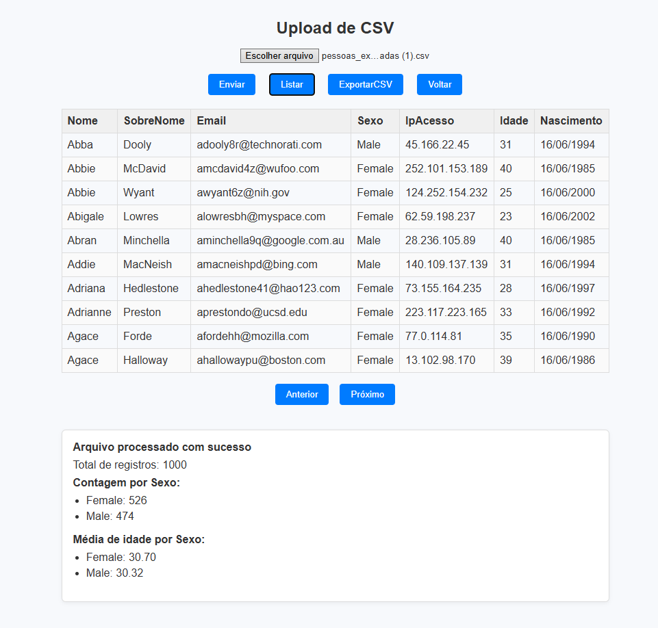

# Desafio  - Multi Portal

## Descrição

Projeto desenvolvido para o desafio do processo seletivo da Multi Portal. O objetivo é importar dados  de um arquivo CSV, corrigir as informações, processar e armazenar em um banco de dados PostgreSQL, além de exibir estatísticas e permitir exportação dos dados corrigidos.

---

## Funcionalidades

- Tela de login simples com usuário e senha predefinidos, usando Spring Security para gerenciar a sessão.
- Upload de arquivo CSV pela interface web.
- Processamento dos dados em memória:
    - Ordenação dos registros pelo nome.
    - Contagem de homens e mulheres.
    - Correção da data de nascimento com base na idade informada.
    - Cálculo da média de idade por gênero.
- Persistência dos dados no banco PostgreSQL via JPA/Hibernate.
- Exibição dos dados processados em tela.
- Exportação dos dados corrigidos em CSV através de botão na interface.

---

## Tecnologias utilizadas

- Java 17+
- Spring Boot
- Spring MVC
- Spring Security
- Thymeleaf
- Flyway (para controle de versão do banco)
- PostgreSQL
- Docker

---

## Login padrão

| Usuário | Senha    |
|---------|----------|
| admin   | admin123 |

---

## Como executar

### 1. Clonar o projeto

```bash
git clone https://github.com/Newtroniano/mp-csv-migration.git
cd seuprojeto
```

### 2. Rodando via Docker
Para facilitar a execução do projeto, recomenda-se rodar a aplicação via Docker.

Passos:

1. Instale o Docker e o Docker Compose na sua máquina, caso ainda não tenha.

2. Na pasta raiz do projeto, execute o comando:

```bash
docker-compose up --build
```
3. Após a construção e inicialização do container, a aplicação estará rodando.

4. Acesse a aplicação no navegador pelo endereço:

```bash
http://localhost:8080
```


### 3. Rodando sem Docker
Caso não utilize Docker, é necessário:

1. Ter o PostgreSQL instalado e rodando na sua máquina.

2. Criar o banco de dados chamado csv_reader manualmente.


### 4. Usando a aplicação 

Após abrir a página inicial, você poderá fazer login com o usuário padrão ou criar um novo usuário. Em seguida, utilize este CSV para realizar a migração dos dados: [dados para migração](https://drive.google.com/file/d/1Fhz6xBHluGdkfjVskpDw3KPpsTHohow4/view?usp=drive_link).

Ao enviar o arquivo, os dados serão salvos no banco de dados. Em seguida, a aplicação exibirá:

- A quantidade de homens e mulheres;
- A média de idade por sexo;
- Os nomes ordenados, conforme mostrado na imagem abaixo:

***Depois de enviar, você poderá clicar no botão Listar para exibir a lista dos registros.***



Após importar os dados, você pode exportá-los ao clicar no botão ExportarCSV com os nomes em ordem e com as datas de nascimento corrigidas no formato CSV.